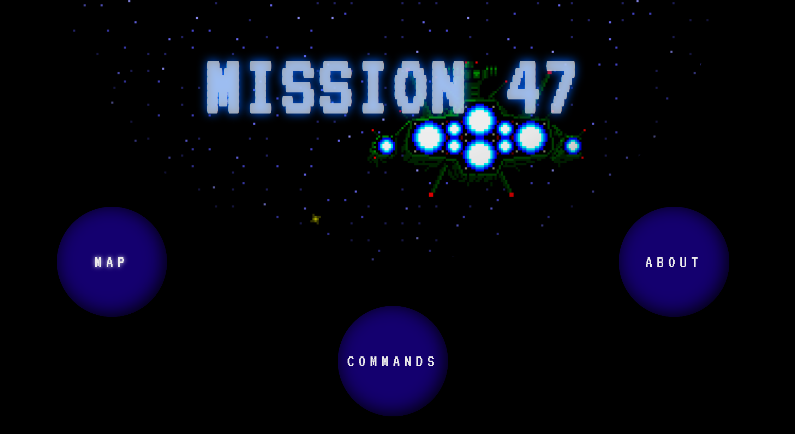

# Mission 47
Mission 47 is an interactive text-based adventure game, in which the player, a spaceship captain, must journey
47 light years to save their crew from execution by a Tilani warlord. 

Notes: Specific game events randomize during each play through, making a more engaging playing experience by altering 
player's strategies.
## Installation
No installation required. 
Users can play the game using a Java IDE or their operating system's built-in terminal, such as **Windows PowerShell** 
for Windows OS users or **Terminal** for macOS users.

The user can read the user manual through a text editor, such as **Notepad** or **Notepad++**.  
An online user manual is also provided via this link: 
<a href="http://localhost:63342/Mission_47/UserManual/Website/index.html?_ijt=iib8tgobql5jn06t9ojpmrvcs3">Click here</a>.

## Visuals
 
 
 
 

## Usage