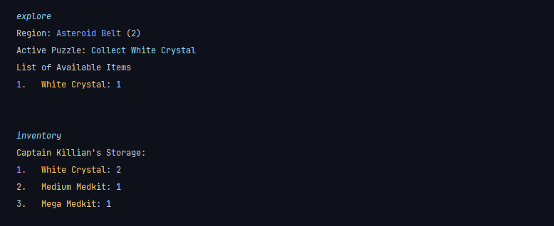
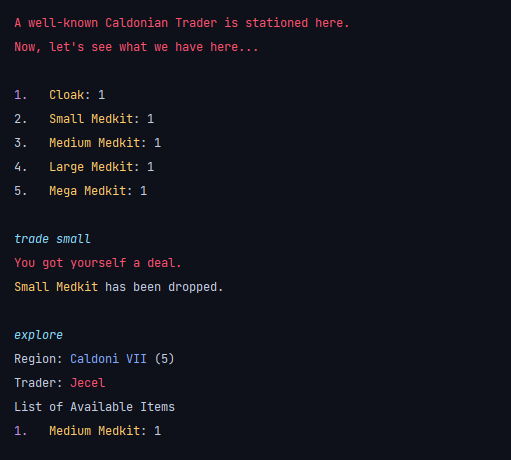

# Mission 47
Mission 47 is an interactive text-based adventure game, in which the player, a spaceship captain, must journey
47 light years to save their crew from execution by a Tilani warlord.

### Text File Data Structure Reference
This file describes, in detail, the structure of each text file located in Mission_47 project package.
This is for the developer's reference only.

NOTE: "----" functions as a delimiter to separate general from specific component properties.

#### GlobalMessages.txt

GAME NAME

Name of game

----

GAME INSTRUCTIONS

How to play game

----

GAME DESCRIPTION
            

General game description

----

PROLOGUE
                    

Game storyline

----

SPLASH SCREEN
               

Allows player to enter "yes" or "no" to start the game

----

ENTER NAME SCREEN
           

Allows player to enter their character's name

#### Puzzles.txt

PUZZLE ID

Puzzle identifier

PUZZLE NAME

Name of puzzle

PUZZLE DESCRIPTION

Description for puzzle

----

PUZZLE HINT

Brief hint for puzzle

PUZZLE ANSWER

Answer for puzzle

ROOM ID

Room in which the puzzle activates

MAX ATTEMPTS

Number of attempts player has to complete puzzle before resetting when player leaves room

ITEM ID

Item identifier for reward once puzzle is complete

LOCKEDROOMID

Rooms that the puzzle unlocks upon solving

#### Items.txt

ITEM ID

Item identifier

ITEM NAME

Name of item

ITEM DESCRIPTION

Description for item

----

ROOM ID

Which room item is located in

TRADE OUTPUT

What item can be traded for

#### Rooms.txt

ROOM ID

Room identifier

ROOM NAME

Name of room

ROOM DESCRIPTION

Description for room

----

LOCKED/UNLOCKED

Either locked or unlocked

NORTH #

Room ID located to north of room, # is blank if there is no connection

SOUTH #

Room ID located to south of room, # is blank if there is no connection

EAST #

Room ID located to east of room, # is blank if there is no connection

WEST #

Room ID located to west of room, # is blank if there is no connection

# # # #

List of any number of items in room, separated by a blank space

#### Trader.txt

TRADER ID

Trader identifier

TRADER NAME

Name of trader

TRADER DESCRIPTION

Description for trader

----

ROOM ID

Which room trader is located in

# # # #

List of any number of items in trader inventory, separated by a blank space

#### Monster.txt

MONSTER ID

Monster identifier

MONSTER NAME

Name of monster

MONSTER DESCRIPTION

Description for monster

----

ROOM ID

Which room monster is located in

HEALTH

Initial health

DAMAGE THRESHOLD

Value (max 100) at which the attack damage will double

ATTACK DAMAGE

Initial monster attack damage

DEATH MESSAGE

Description that appears if the monster dies

## Installation
No installation required. 
Users can play the game using a Java IDE or their operating system's built-in terminal, such as **Windows PowerShell** 
for Windows OS users or **Terminal** for macOS users.

The user can read the user manual through a text editor, such as **Notepad** or **Notepad++**.  
An online user manual is also provided via this link: 
<a href="http://localhost:63342/Mission-47-Java/Mission_47/Website/index.html">Click here</a>.

## Visuals
 
 
 
 
 
 
 
 
 
 
 
 
 
